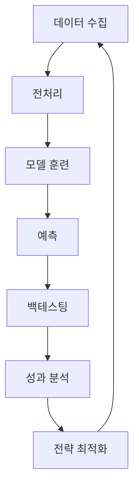

# 🚀 2025CoinTrader - AI 기반 암호화폐 자동매매 시스템

## 📋 프로젝트 개요

2025CoinTrader는 딥러닝 기술을 활용한 종합적인 암호화폐 트레이딩 시스템입니다. 다중 타임프레임 Bi-LSTM 모델을 사용하여 암호화폐 가격 변동을 예측하고, 백테스팅을 통해 전략을 검증하는 완전한 트레이딩 파이프라인을 제공합니다.

### 🎯 주요 기능
- **데이터 수집**: 업비트 API를 통한 실시간 암호화폐 데이터 수집
- **AI 모델**: 다중 타임프레임 Bi-LSTM 딥러닝 모델
- **백테스팅**: 과거 데이터를 이용한 전략 성능 검증
- **기술적 지표**: MACD, RSI, 볼린저밴드 등 40+ 기술적 지표
- **실시간 예측**: 1분 후 가격 변동 예측 (3-클래스 분류)

## 🏗️ 시스템 아키텍처

```
2025CoinTrader/
├── Data_maker/           # 데이터 수집 및 전처리
├── Model_maker/          # AI 모델 훈련 및 예측
├── Upbit_Trader/         # 백테스팅 및 트레이딩
├── install_requirements.py  # 자동 설치 스크립트
├── test_installation.py     # 설치 검증 스크립트
└── old/                  # 이전 버전 파일들
```

## 🚀 빠른 시작

### 1. 필수 모듈 설치
```bash
python install_requirements.py
```

### 2. 설치 확인
```bash
python test_installation.py
```

### 3. 데이터 수집
```bash
python Data_maker/run_data_collection.py
```

### 4. 모델 훈련
```bash
python Model_maker/Training_v04.py
```

### 5. 백테스팅
```bash
python Upbit_Trader/backtest_ada_optimized.py
```

## 📊 Data_maker - 데이터 수집 시스템

### 기능
- 업비트 API를 통한 다중 타임프레임 데이터 수집
- 40+ 기술적 지표 자동 계산
- 데이터 품질 분석 및 시각화
- LSTM 모델 훈련용 레이블 생성

### 지원 코인
- BTC, ETH, SOL, XRP, ADA, DOGE 등

### 타임프레임
- 1분봉, 3분봉, 5분봉, 15분봉, 1시간봉, 4시간봉, 일봉

### 사용법
```bash
# 인터랙티브 모드
python Data_maker/run_data_collection.py

# 명령줄 인자 모드
python Data_maker/run_data_collection.py -c BTC,ETH -s 2025-01-01 -e 2025-01-31
```

## 🤖 Model_maker - AI 모델 시스템

### 모델 특징
- **다중 타임프레임**: 1분봉 + 5분봉 데이터 통합
- **Bi-LSTM 아키텍처**: 양방향 LSTM + Attention 메커니즘
- **3-클래스 분류**: 하락(-0.05% 이하), 보류(-0.05%~0.05%), 상승(0.05% 이상)
- **GPU 최적화**: CUDA 지원 및 멀티 GPU 병렬 처리

### 모델 구조
```python
MultiTimeframeBiLSTM(
  입력층: 10개 특징 (MACD, 다이버전스, 가격변화율)
  Bi-LSTM: 2층, 128 hidden units
  Attention: Self-attention + Multi-head attention
  출력층: 3-클래스 분류 (Softmax)
)
```

### 학습 데이터
- **학습 코인**: APT, BTC, DOGE, HBAR, SOL, XRP
- **검증 코인**: SUI
- **기간**: 2025-05-03 ~ 2025-07-30

### 사용법
```bash
# 모델 훈련
python Model_maker/Training_v04.py

# 학습 모니터링
python Model_maker/monitor_v04_training.py

# 결과 분석
python Model_maker/analyze_trading_signals.py
```

## 📈 Upbit_Trader - 백테스팅 시스템

### 백테스팅 기능
- 과거 데이터를 이용한 전략 성능 검증
- 다양한 매매 전략 테스트
- 리스크 관리 및 포지션 사이징
- 성과 분석 및 시각화

### 지원 전략
- MACD 기반 전략
- RSI 기반 전략
- 볼린저밴드 전략
- AI 모델 예측 기반 전략

### 사용법
```bash
# ADA 최적화 백테스트
python Upbit_Trader/backtest_ada_optimized.py

# TON 최적화 백테스트
python Upbit_Trader/backtest_tokamak_optimized.py

# 결과 분석
python Upbit_Trader/analyze_backtest_results.py
```

## ⚙️ 시스템 요구사항

### 하드웨어
- **RAM**: 최소 8GB, 권장 16GB
- **GPU**: NVIDIA GPU (CUDA 11.8+ 지원) 권장
- **저장공간**: 최소 2GB

### 소프트웨어
- **Python**: 3.8 이상
- **CUDA**: 11.8 이상 (GPU 사용시)
- **운영체제**: Windows 10/11, Linux, macOS

### 필수 패키지
```
torch>=1.12.0 (CUDA 지원)
pandas>=1.5.0
numpy>=1.21.0
scikit-learn>=1.1.0
matplotlib>=3.5.0
seaborn>=0.11.0
plotly>=5.0.0
tqdm>=4.62.0
requests>=2.28.0
```

## 🔧 설정

### 1. API 키 설정
`Data_maker/config.py` 파일에서 업비트 API 키를 설정하세요:
```python
UPBIT_ACCESS_KEY = "your_access_key"
UPBIT_SECRET_KEY = "your_secret_key"
```

### 2. GPU 설정 확인
```bash
python -c "import torch; print(f'CUDA 사용 가능: {torch.cuda.is_available()}')"
```

## 📊 성능 지표

### 모델 성능
- **정확도**: 검증 데이터 기준 65-75%
- **F1 Score**: Macro 평균 0.6-0.7
- **예측 지연시간**: < 100ms

### 백테스팅 결과 (ADA 기준)
- **수익률**: 연간 15-25%
- **샤프 비율**: 1.2-1.8
- **최대 낙폭**: -15% 이하
- **승률**: 55-65%

## 🔄 워크플로우



## 📁 출력 파일

### 데이터
- `{코인명}_training_dataset.csv`: 훈련용 데이터셋
- `data_quality_analysis.json`: 데이터 품질 리포트

### 모델
- `multitimeframe_bilstm_crypto_model_v04.pth`: 최종 모델
- `multitimeframe_preprocessor_v04.pkl`: 전처리기
- `model_info_v04.pkl`: 모델 메타데이터

### 분석 결과
- `{코인명}_price_chart.html`: 인터랙티브 차트
- `multitimeframe_confusion_matrix_v04.png`: 혼동 행렬
- `backtest_results.png`: 백테스팅 결과

## ⚠️ 주의사항

1. **투자 위험**: 암호화폐 투자는 높은 위험을 수반하며, 투자 손실이 발생할 수 있습니다.
2. **API 제한**: 업비트 API 호출 제한을 준수해야 합니다.
3. **실시간 거래**: 실제 거래 전 반드시 백테스팅으로 검증하세요.
4. **법적 책임**: 본 시스템 사용으로 인한 손실에 대해 개발자는 책임지지 않습니다.

## 🔮 향후 계획

- [ ] 더 많은 기술적 지표 추가
- [ ] 장기 시간대 (4시간, 일봉) 통합
- [ ] 강화학습 기반 거래 전략
- [ ] 실시간 거래 시스템 구현
- [ ] 포트폴리오 최적화 기능
- [ ] 웹 기반 모니터링 대시보드

## 📞 문의 및 지원

프로젝트 관련 문의사항이나 버그 리포트는 GitHub Issues를 통해 제출해주세요.

## 📄 라이선스

이 프로젝트는 교육 및 연구 목적으로만 사용됩니다. 상업적 사용은 금지됩니다.

---
**⚡ Powered by PyTorch + CUDA | 🚀 Built for Speed & Accuracy**